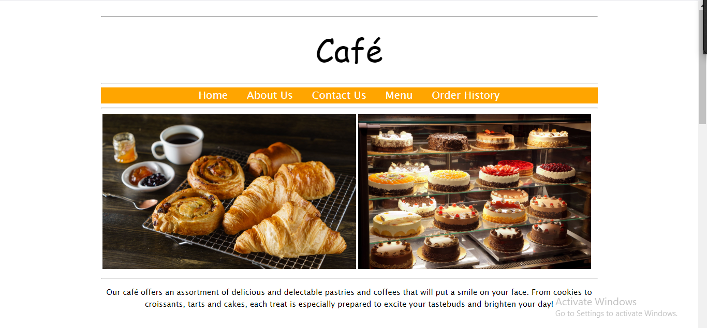
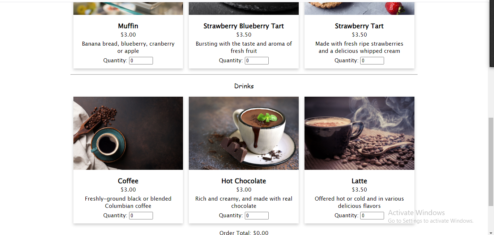
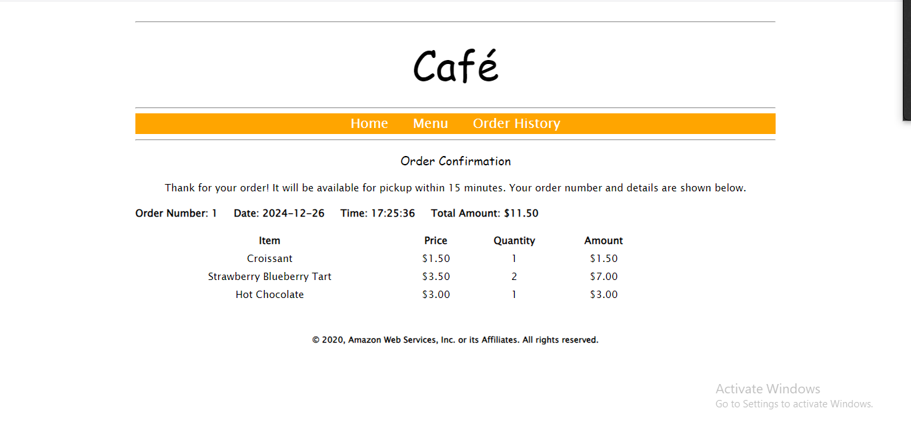
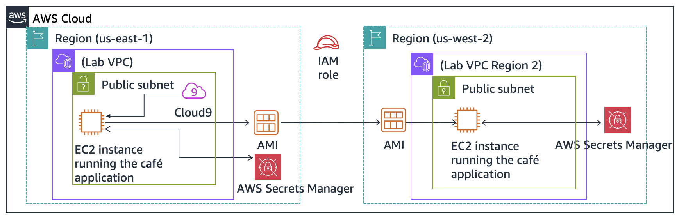
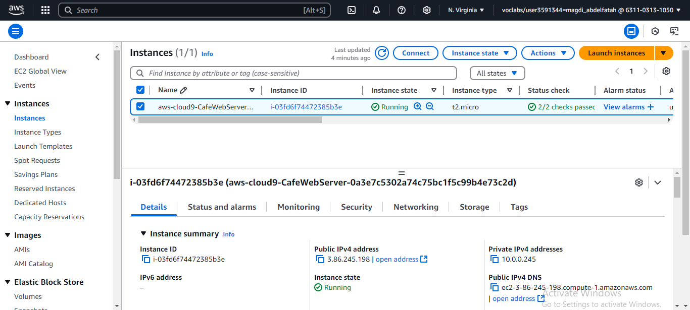
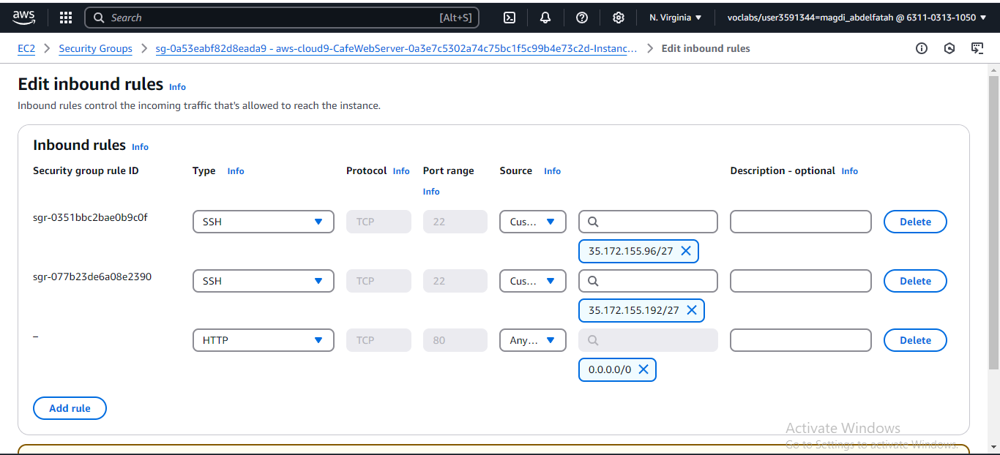
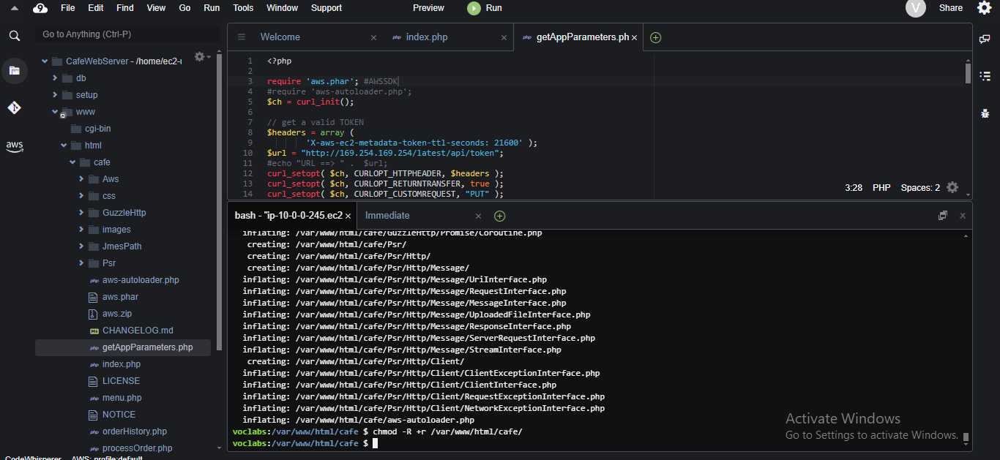
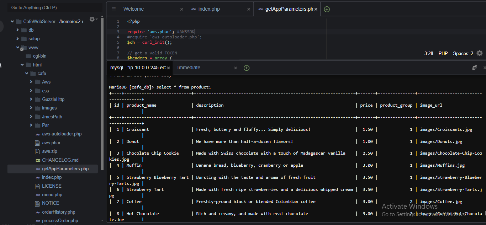
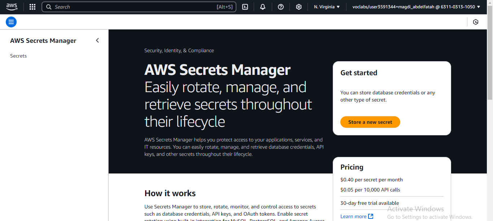
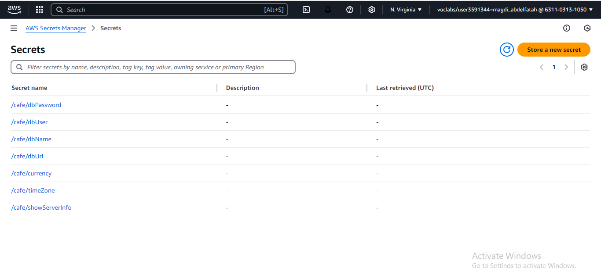

Café Online Ordering System
Overview
This repository contains the setup and configuration for a dynamic website for the café that allows customers to place online orders.
The website is hosted on Amazon EC2 instances, and it includes a backend using MySQL, PHP, and a web server (Apache). 
The system also leverages AWS Secrets Manager to store sensitive credentials and AWS Cloud9 for development.

Features

Online Ordering: Customers can view the café menu and place orders.

Order History: Staff can view a history of all orders placed.

Dynamic Website: The website supports dynamic content, including customer orders and menu management.

Disaster Recovery: The system is set up in multiple AWS Regions to ensure high availability and disaster recovery.

Architecture

AWS EC2 Instances: Used to host the website in different AWS Regions (Development in us-east-1 and Production in us-west-2).

AWS Secrets Manager: Manages the sensitive configuration settings such as database credentials.

AWS Cloud9: Provides the development environment for managing and deploying the café website.

LAMP Stack: Apache, MySQL, and PHP are used for the web application and database.

Installation

Prerequisites

An AWS account

AWS CLI installed and configured

SSH key pair (for connecting to EC2 instances)

Steps to Deploy

Launch EC2 Instances:

Launch EC2 instances in your chosen AWS regions.

Configure security groups to allow HTTP and SSH access.

Use the Cloud9 IDE for accessing and managing your EC2 instances.

Set up the LAMP stack:

Install Apache and MySQL on the EC2 instances:

bash

Copy code

sudo yum install httpd

sudo service httpd start

sudo yum install mariadb-server

sudo service mariadb start

Install PHP:

Install PHP on the EC2 instance:

bash

Copy code

sudo yum install php php-mysql

Download and Configure the Application:

Download the application setup files:

bash

Copy code

wget <file-url>  # Replace with actual file URL

unzip setup.zip

Set up the database:

bash

Copy code

cd db/

./set-root-password.sh

./create-db.sh

Update the PHP configuration:

bash

Copy code

sudo sed -i "2i date.timezone = \"America/New_York\" " /etc/php.ini

sudo service httpd restart

Set up AWS Secrets Manager:

Create the necessary parameters in AWS Secrets Manager:

bash

Copy code

cd environment/setup/

./set-app-parameters.sh

Test the Website:

Open the website in a browser:

url

Copy code

http://<public-ip>/cafe

Creating an AMI and Deploying to a New Region

Create an AMI:

From the EC2 Console, select the instance and create an AMI image.

Launch an Instance in Another Region:

Launch a new EC2 instance in the desired AWS region (e.g., Oregon).

Use the AMI from the previous step to launch the new instance.

Configure Secrets in the New Region:

Update the set-app-parameters.sh script with the new region and instance DNS.

Run the script to configure the secrets in Secrets Manager for the new instance.

Test the Production Environment:

Open the website in a browser for the new instance’s public IP.

Troubleshooting

Website not loading:

Ensure the web server and database are running.

Check security group settings to ensure HTTP/HTTPS access is allowed.

Ensure the AWS Secrets Manager has the correct parameters set.

Order functionality not working:

Verify that the database is correctly set up with required tables and data.

Check the PHP configuration and logs for any errors.

Conclusion

This project sets up a dynamic online ordering system for the café that can scale across multiple AWS regions for development and production environments.
The architecture ensures high availability and disaster recovery.

project-folder/
├── arch-snippets
├── README.md
├── css
├── images
├── .git
├── .gitignore
├── index.html